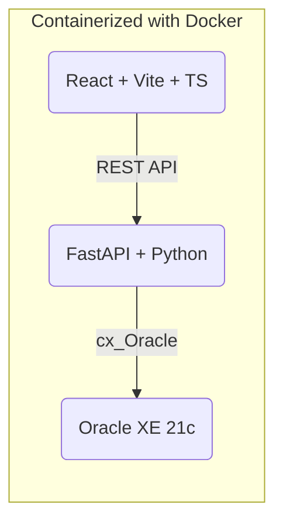

# CoopManager 🏢


**CoopManager** is a comprehensive Housing Cooperative Management System designed to streamline the administration of buildings, residents, utilities, and payments. It features a robust **Admin Panel** for management and a **Resident Portal** for transparency.

This project was developed as a final assignment, integrating advanced database concepts including **PL/SQL Procedures, Functions, Triggers, Views**, and **Dynamic SQL**.

---

## 🚀 Live Demo & Access

- **URL:** [mariukha.pl/bazy/](https://mariukha.pl/bazy/)
- **Admin Credentials:**
  - Login: `admin`
  - Password: `admin123`

---

## 🏗️ Architecture

The application follows a modern 3-tier architecture:



---

## ✨ Key Features

### 🔧 **Administrator Panel**
- **Dashboard**: Real-time statistics including total revenue, member count, and arrears monitoring.
- **Entity Management**: CRUD operations for Buildings, Apartments, Members, and Employees.
- **Advanced Tools**:
  - **Fee Calculation**: Automated fee addition using PL/SQL function `dodaj_oplate_fn` (auto-calculates based on usage).
  - **Global Updates**: Batch price increases via `zwieksz_oplaty` procedure.
  - **Audit Logs**: Full history of changes (INSERT/UPDATE/DELETE) tracked by `trg_audit_czlonek`.
- **Reports**: Financial analytics and status reports powered by SQL Views (Lab 9 & 10).

### 👤 **Resident Portal**
- **Personal Dashboard**: View assigned apartment details.
- **Payment History**: Track paid and unpaid bills.
- **Repairs**: Submit and monitor repair requests.
- **Community**: View upcoming meetings and announcements.

---

## 🛠️ Tech Stack

| Layer | Technology | Description |
|-------|------------|-------------|
| **Frontend** | React 18, TypeScript | Built with **Vite**, styled with **TailwindCSS** & **Lucide Icons**. |
| **Backend** | Python 3.11, FastAPI | High-performance REST API with **Pydantic** validation. |
| **Database** | Oracle Database 21c XE | Enterprise-grade DB with complex PL/SQL logic. |
| **DevOps** | Docker Compose | Orchestration for all 3 services + volumes. |

---

## 🧪 Laboratory Requirements Implementation

This project implements requirements from Labs 7 through 13:

| Lab | Feature / Concept | Implementation in Project |
|:---:|-------------------|---------------------------|
| **7** | **Basic CRUD** | Full CRUD for 10+ tables (Residents, Buildings, etc.) |
| **8** | **Aggregation** | Dashboard statistics (SUM, COUNT, GROUP BY) |
| **9** | **Views** | `v_mieszkania_info` (Simple), `v_oplaty_summary` (Complex), `v_naprawy_status` |
| **10** | **Advanced Joins** | Reports using LEFT, RIGHT, FULL OUTER, CROSS, and SELF JOINs |
| **11** | **Procedures & Functions** | `zwieksz_oplaty` (Procedure), `dodaj_oplate_fn` (Function), `pobierz_czlonkow` (Cursor) |
| **12** | **Packages** | `coop_pkg` containing business logic for calculations |
| **13** | **Triggers & Dynamic SQL** | `trg_audit_czlonek` (Audit Log), `policz_rekordy` (Dynamic SQL via `EXECUTE IMMEDIATE`) |

---

## 📦 Installation & Setup

### Prerequisites
- Docker & Docker Compose installed
- Git

### Quick Start
1.  **Clone the repository:**
    ```bash
    git clone https://github.com/mariukha/CoopManager.git
    cd CoopManager
    ```

2.  **Launch with Docker:**
    ```bash
    docker-compose up -d
    ```
    > **Note:** The first run may take **3-5 minutes** as the Oracle Database initializes.

3.  **Verify Status:**
    Check if all containers are healthy:
    ```bash
    docker-compose ps
    ```

4.  **Access the App:**
    - Frontend: [http://localhost:3000](http://localhost:3000)
    - Backend API: [http://localhost:8000/docs](http://localhost:8000/docs)

### Troubleshooting
- **Timezone Issues:** The application is configured for `Europe/Warsaw` (CET). If logs show incorrect times, ensure your Docker host time is correct.
- **Database Connection:** If the backend fails to connect, ensure the `oracle-xe-prod` container is `healthy` before the backend starts (handled by `depends_on`).

---

## 👥 Authors
- **Maksym Mariukha**
- **Reznik**
- **Labunskyi**

---

*Project created for Database Systems course at PJATK.*
